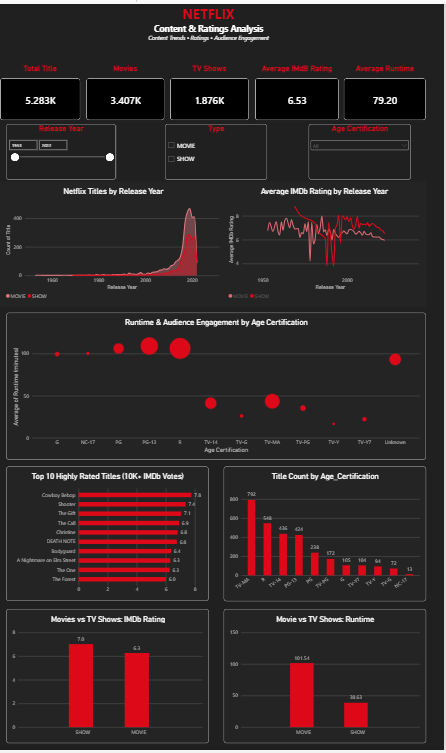

# Netflix Content & Ratings Analysis

## Project Overview

This project analyzes a Netflix content dataset to understand content composition, release trends, IMDb ratings, runtime patterns, and audience engagement.

The analysis was developed as an independent data analytics project using Excel and Power BI, with the goal of transforming raw content data into meaningful business insights through an interactive dashboard.

---

## Objectives

The analysis focuses on:

- Understanding the composition of Movies and TV Shows
- Analyzing content trends across release years
- Comparing IMDb ratings between Movies and TV Shows
- Comparing runtime patterns across content formats
- Identifying highly rated titles with meaningful audience engagement
- Exploring audience engagement across age-certification categories
- Developing business recommendations from the analysis

---

## Dataset

The dataset contains **5,283 titles** and includes information such as:

- Title
- Content Type
- Release Year
- Age Certification
- Runtime
- Genres
- Production Countries
- IMDb Rating
- IMDb Votes

The dataset covers titles released between **1953 and 2022**.

---

## Tools Used

- **Microsoft Excel** — Data inspection and preparation
- **Power BI Desktop** — Data modeling, visualization, dashboard development
- **Power Query** — Data cleaning and transformation
- **GitHub** — Project documentation and portfolio management

---

## Dashboard

The Power BI dashboard provides an interactive view of:

- Total Titles
- Movies and TV Shows
- Average IMDb Rating
- Average Runtime
- Content trends by Release Year
- IMDb rating trends over time
- Runtime and audience engagement by Age Certification
- Top 10 highly rated titles with 10K+ IMDb votes
- Title distribution by Age Certification
- Movies vs TV Shows rating comparison
- Movies vs TV Shows runtime comparison

### Dashboard Preview

---

## Key Insights

### 1. Content Mix

Movies account for approximately **64.5%** of the dataset, while TV Shows represent **35.5%**.

This indicates that the dataset contains a significantly larger movie catalog, although TV Shows form a substantial portion of the overall content mix.

### 2. Content Growth Over Time

The number of titles is concentrated in the **late 2010s and early 2020s**, showing a strong increase in the volume of recently released content represented in the dataset.

The release year reflects when titles were released, rather than necessarily when Netflix produced or acquired them.

### 3. TV Shows Have Higher Average IMDb Ratings

TV Shows have an average IMDb rating of **7.02**, compared with **6.27** for Movies.

This represents a difference of approximately **0.75 rating points**, indicating stronger average IMDb ratings for TV Shows in this dataset.

### 4. Movies Have Longer Average Runtime

Movies have an average runtime of approximately **101.5 minutes**, compared with **38.6 minutes** for TV Shows.

This reflects the fundamentally different viewing formats of Movies and episodic TV content.

### 5. Audience Engagement by Age Certification

**R-rated content has the largest total IMDb vote volume** among the age-certification categories shown in the dashboard.

This indicates particularly strong audience engagement within this segment based on total IMDb votes.

### 6. Highly Rated Titles and Audience Engagement

Among titles with **10K+ IMDb votes**, the highest rating visible in the Top 10 analysis is **7.8**.

This highlights the importance of considering both rating and audience engagement when evaluating content performance rather than relying on rating alone.

---

## Business Recommendations

### 1. Balance the Content Portfolio

The larger share of Movies suggests maintaining a strong movie offering while identifying opportunities to expand high-performing TV Show segments.

### 2. Focus on Recent Content Performance

Recent content should be analyzed further by genre, format, rating, and audience engagement to identify the segments contributing most strongly to content performance.

### 3. Investigate Higher-Rated TV Show Characteristics

The higher average IMDb rating for TV Shows suggests an opportunity to investigate characteristics such as genre, certification, and content format that may be associated with stronger audience ratings.

### 4. Use Format-Specific Performance Measures

Movies and TV Shows have substantially different runtimes and viewing formats. Their performance should therefore be evaluated using appropriate, format-specific KPIs rather than identical benchmarks.

### 5. Explore High-Engagement Certification Segments

The high IMDb vote volume for R-rated content provides a basis for deeper analysis by genre, rating, and release period to understand the factors associated with stronger audience engagement.

### 6. Combine Quality and Engagement Metrics

Content evaluation should combine **audience ratings and engagement measures** rather than relying on a single metric. Titles with strong ratings and substantial audience activity provide stronger evidence of audience appeal.

---

## Project Files

| File | Description |
|---|---|
| `Netflix.xlsx` | Source dataset used for the analysis |
| `Netflix_Dashboard.pbix` | Power BI dashboard and analysis |
| `Netflix_Dashboard.png` | Dashboard preview image |
| `README.md` | Project documentation |

---

## Overall Recommendation

The analysis suggests that content performance should be evaluated across multiple dimensions, including **content format, release period, audience ratings, certification, and audience engagement**, rather than relying on a single metric.

> **Note:** This is an independent analysis of a Netflix dataset and does not represent official Netflix strategy or recommendations.

---

## Author
**Pankhuri**
**Pankhuri S**

Aspiring Data Analyst | Excel | Power BI | SQL | Python | Data Analytics
